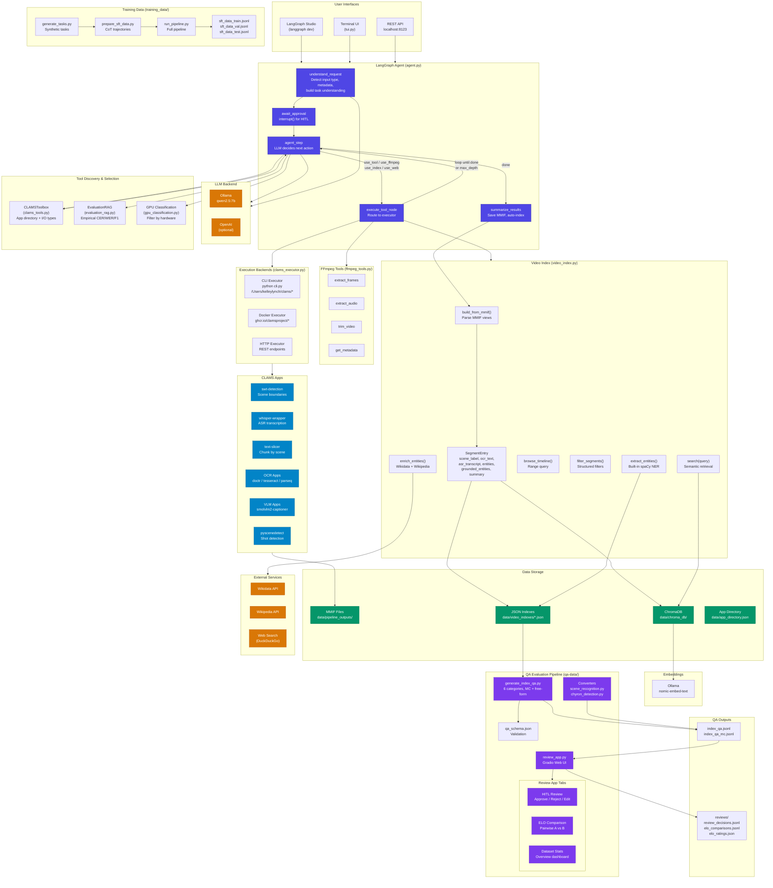
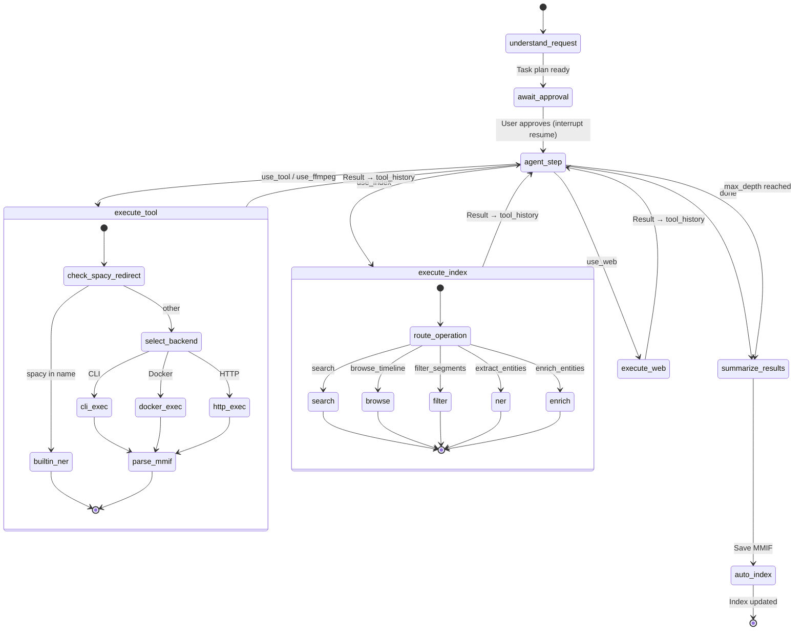
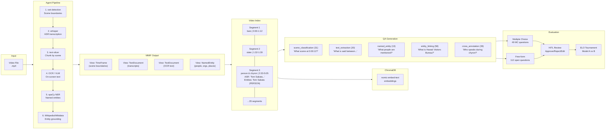
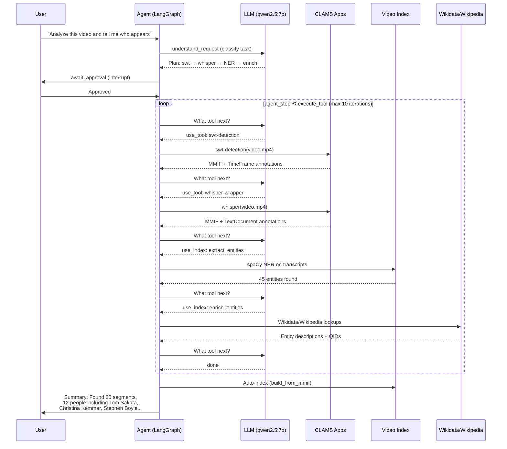

# CLAMS Agent - Architecture & Pipeline Diagram

## Full System Architecture



## Agent State Graph (Detailed)



## Data Flow: Video → Index → QA → Evaluation



## Typical Pipeline Execution



## File Structure

```
clams-agent-prototype/
├── agent.py                     # LangGraph StateGraph (5 nodes, iterative loop)
├── langgraph.json               # LangGraph Studio config
├── config.json                  # Runtime config (LLM, execution, index)
├── tui.py                       # Terminal UI (Textual)
│
├── utils/
│   ├── clams_tools.py           # Tool discovery (apps.clams.ai)
│   ├── clams_executor.py        # Unified executor (CLI/Docker/HTTP)
│   ├── execution_backend.py     # Backend implementations
│   ├── video_index.py           # Hybrid JSON + ChromaDB index
│   ├── evaluation_rag.py        # Evidence-based tool selection
│   ├── ffmpeg_tools.py          # Video preprocessing
│   ├── frame_review.py          # HITL frame review → MMIF
│   ├── advanced_reasoning.py    # Knowledge tools
│   ├── model_providers.py       # LLM abstraction
│   ├── config.py                # Configuration management
│   ├── gpu_classification.py    # App GPU requirements
│   └── experiment_tracker.py    # Experiment logging
│
├── data/
│   ├── app_directory.json       # Cached CLAMS app metadata
│   ├── video_indexes/           # Per-video JSON indexes
│   ├── chroma_db/               # ChromaDB vector store
│   └── pipeline_outputs/        # Generated MMIF files
│
├── qa-data/
│   ├── generate_index_qa.py     # QA pair generation (6 categories)
│   ├── review_app.py            # Gradio review + ELO app
│   ├── schema/qa_schema.json    # QA entry validation schema
│   ├── converters/              # AAPB annotation → QA converters
│   ├── raw/                     # Generated JSONL files
│   └── reviews/                 # HITL decisions + ELO data
│
├── training_data/
│   ├── generate_tasks.py        # Synthetic task generation
│   ├── prepare_sft_data.py      # CoT trajectory creation
│   ├── run_pipeline.py          # Full SFT pipeline
│   └── prompts/                 # LLM prompt templates
│
└── docs/
    └── architecture.md          # This file
```
