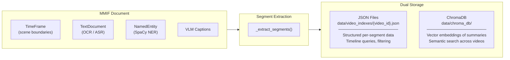
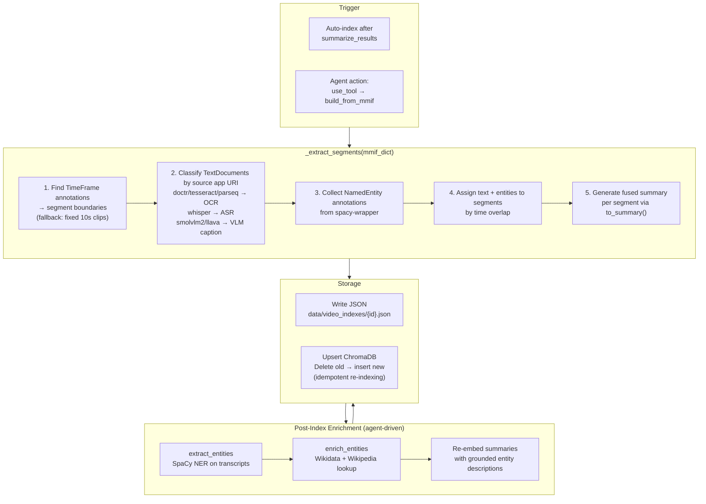
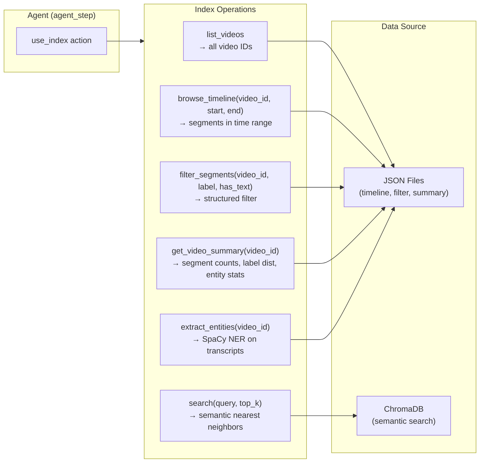
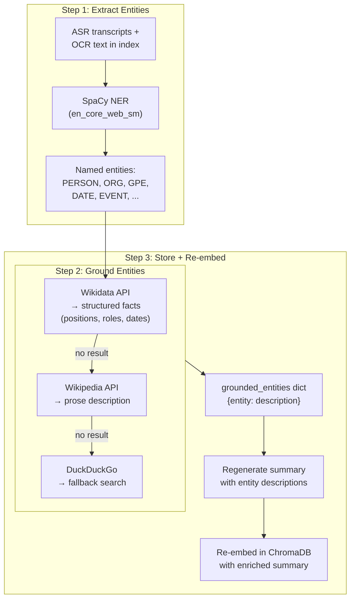

# Video Index Architecture

## Overview

The video index is a hybrid storage system that combines structured JSON files (per-video) with ChromaDB vector search (across all videos). It enables the agent to answer questions about video content by querying pre-extracted annotations from CLAMS pipelines.

## Dual Storage Architecture



## JSON Index Schema (per video)

```
┌─────────────────────────────────────────────────────────────────┐
│ data/video_indexes/{video_id}.json                              │
├─────────────────────────────────────────────────────────────────┤
│                                                                 │
│  video_id        "cpb-aacip-225-009w0w1j"                       │
│  video_path      "/path/to/video.mp4"                           │
│  duration_ms     3491758                                        │
│  indexed_at      "2026-03-07T22:28:16Z"                         │
│  source_mmif     "/path/to/output.mmif"                         │
│                                                                 │
│  segments: [                                                    │
│  ┌─────────────────────────────────────────────────────────────┐│
│  │ SegmentEntry                                                ││
│  ├────────────────┬────────────────────────────────────────────┤│
│  │ segment_id     │ "cpb-aacip-225-009w0w1j_227528_305506"     ││
│  │ start_ms       │ 227528                                     ││
│  │ end_ms         │ 305506                                     ││
│  │ scene_label    │ "person & chyron"                          ││
│  │ segment_type   │ "interview"                                ││
│  │ classification │ {"person & chyron": 0.504}                 ││
│  │ ocr_text       │ "MUFI HANNEMANN - Hawaii Visitors Bureau"  ││
│  │ asr_transcript │ "Thank you. We'll hear what Mufi has..."   ││
│  │ visual_caption │ ""                                         ││
│  │ named_entities │ [{text: "Mufi", type: "PERSON"},           ││
│  │                │  {text: "Tom Sakata", type: "PERSON"},     ││
│  │                │  {text: "Hawaii", type: "GPE"}]            ││
│  │ grounded_ents  │ {"Mufi": "female given name...",           ││
│  │                │  "Tom Sakata": "Hawaii Visitors Bureau..."} ││
│  │ keywords       │ ["tourism", "waikiki"]                     ││
│  │ summary        │ "[speaker with name/title overlay] (78s)   ││
│  │                │  Speech: Thank you... About: Mufi: ..."    ││
│  └────────────────┴────────────────────────────────────────────┘│
│  , ...  (35 segments)                                           │
│  ]                                                              │
└─────────────────────────────────────────────────────────────────┘
```

## ChromaDB Collection Schema

```
┌─────────────────────────────────────────────────────────────────┐
│ Collection: "video_segments"  (1,767 documents across 11 videos)│
├─────────────────────────────────────────────────────────────────┤
│                                                                 │
│  id         segment_id (globally unique)                        │
│  document   summary text (fused from all segment fields)        │
│  embedding  768-dim vector (nomic-embed-text via Ollama)        │
│                                                                 │
│  metadata:                                                      │
│  ┌──────────────┬──────────────────────────────┐                │
│  │ video_id     │ "cpb-aacip-225-009w0w1j"     │                │
│  │ start_ms     │ 227528                       │                │
│  │ end_ms       │ 305506                       │                │
│  │ scene_label  │ "person & chyron"            │                │
│  │ segment_type │ "interview"                  │                │
│  │ has_ocr      │ false                        │                │
│  │ has_asr      │ true                         │                │
│  └──────────────┴──────────────────────────────┘                │
│                                                                 │
│  Embedding model: nomic-embed-text (Ollama, 768 dimensions)     │
│  Fallback: ChromaDB default (all-MiniLM-L6-v2) if Ollama down  │
└─────────────────────────────────────────────────────────────────┘
```

## Indexing Pipeline



## Text Source Classification

How MMIF TextDocument annotations get classified by their producing app:

```
┌────────────────────────────┬──────────────┬─────────────────────────────┐
│ App URI Contains           │ Category     │ Stored In                   │
├────────────────────────────┼──────────────┼─────────────────────────────┤
│ doctr, tesseract,          │ OCR          │ segment.ocr_text            │
│ parseq, easyocr            │              │                             │
├────────────────────────────┼──────────────┼─────────────────────────────┤
│ whisper, distil-whisper    │ ASR          │ segment.asr_transcript      │
├────────────────────────────┼──────────────┼─────────────────────────────┤
│ smolvlm2, llava,           │ VLM Caption  │ segment.visual_caption      │
│ vlm-ocr, captioner         │              │                             │
├────────────────────────────┼──────────────┼─────────────────────────────┤
│ spacy                      │ NER          │ segment.named_entities[]    │
├────────────────────────────┼──────────────┼─────────────────────────────┤
│ tfidf-keyword,             │ Keywords     │ segment.keywords[]          │
│ keywordextract             │              │                             │
└────────────────────────────┴──────────────┴─────────────────────────────┘
```

## Scene Label Taxonomy

SWT-detection produces scene labels that are mapped to semantic categories:

```
┌─────────────────────┬────────────┬─────────────────────────────────────┐
│ Scene Label         │ Category   │ Description                         │
├─────────────────────┼────────────┼─────────────────────────────────────┤
│ bars                │ technical  │ Color bar test pattern              │
│ slate               │ metadata   │ Production slate with metadata      │
│ credits             │ metadata   │ Credits sequence                    │
│ chyron              │ overlay    │ Text overlay                        │
│ other chyron        │ overlay    │ Text overlay (topic/location/info)  │
│ person & chyron     │ interview  │ Speaker with name/title overlay     │
│ person & extra text │ interview  │ Speaker with additional text        │
│ other text          │ text       │ On-screen text                      │
│ filmed text         │ text       │ Text filmed in the environment      │
│ speech              │ audio      │ Speech segment                      │
│ silence             │ audio      │ Silence                             │
│ noise               │ audio      │ Noise segment                       │
│ music               │ audio      │ Music segment                       │
│ shot                │ visual     │ Visual shot boundary                │
└─────────────────────┴────────────┴─────────────────────────────────────┘
```

## Query Operations



## Summary Embedding Format

Each segment's `summary` field is embedded into ChromaDB. The summary fuses all available information into a dense text for semantic retrieval:

```
Format:
  [{scene description}] ({duration}s) On-screen text: {ocr} Speech: {asr}
  Visual: {caption} About: {entity: description}; ... Keywords: {kw1, kw2}

Example (enriched segment):
  [speaker with name/title overlay] (78.0s)
  Speech: Thank you. We'll hear what Mufi has to say about that and the
  rest of the job before him. Tom Sakata is a longtime Hawaii Visitors
  Bureau official picked to be president last fall...
  About: Mufi: female given name. MUFI and Mufi may refer to:;
  Tom Sakata: Hawaii Visitors Bureau official...
  Keywords: tourism, waikiki

Example (simple segment):
  [color bar test pattern] (59.8s) Speech: Thank you. Thank you.
```

## Entity Enrichment Pipeline



## Current Index Stats

```
┌──────────────────────────────────────────────────────────────────┐
│ Index Summary (as of 2026-03-12)                                 │
├──────────────────────────────────────────────────────────────────┤
│ Total videos indexed:    11                                      │
│ Total segments:          1,767 (in ChromaDB)                     │
│ Embedding model:         nomic-embed-text (768-dim)              │
│                                                                  │
│ Videos by segment count:                                         │
│   Future Cop (1977)                    585 segments               │
│   Barbary Coast (1975)                 347 segments               │
│   General Hospital (1979)              179 segments               │
│   ABC Weekend Report (1979)            132 segments               │
│   ABC Weekend Report (1980)            129 segments               │
│   ABC News UN Special (1985)           116 segments               │
│   ABC Nightline (1982)                 110 segments               │
│   Let's Make a Deal (1976)              36 segments               │
│   cpb-aacip-225-009w0w1j               35 segments               │
│   Alexander's Star Commercial (1982)    15 segments               │
│   CBS Family Bumper (1973)               1 segment                │
└──────────────────────────────────────────────────────────────────┘
```

## Planned: Date-Aware Disambiguation

```mermaid
graph TD
    subgraph DATE_SOURCES["Date Sources"]
        KIE["qwen3vl KIE App<br/>→ {date: '9/8/1975',<br/>title: 'Barbary Coast'}"]
        AAPB["AAPB Catalog API<br/>→ broadcast date from<br/>cpb-aacip ID"]
        CHYRON["Chyron OCR<br/>→ date text in<br/>news graphics"]
    end

    subgraph INDEX_DATE["Video Index"]
        BD["broadcast_date field<br/>(video-level)"]
        KV["kv_pairs / metadata<br/>{title, network,<br/>producer, episode}"]
    end

    subgraph DISAMBIG["Date-Aware Enrichment"]
        REF['"the president"<br/>+ date=1975']
        WDQ["Wikidata: who held<br/>P39=President of USA<br/>on 1975-09-08?"]
        RESULT["→ Gerald Ford<br/>(38th President,<br/>1974-08-09 to 1977-01-20)"]
        REF --> WDQ --> RESULT
    end

    DATE_SOURCES --> INDEX_DATE --> DISAMBIG
```

This would enable temporal grounding: ambiguous references like "the president," "the secretary of state," or "the governor" get resolved to specific people based on the broadcast date. The enriched descriptions then improve both the segment summaries and semantic search quality.
